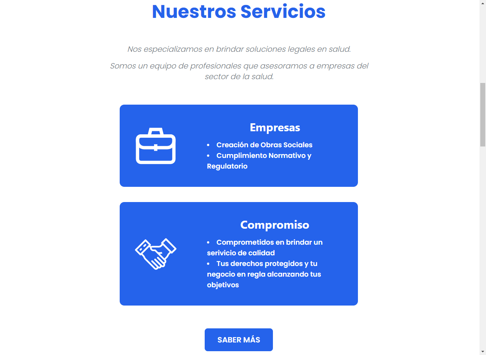
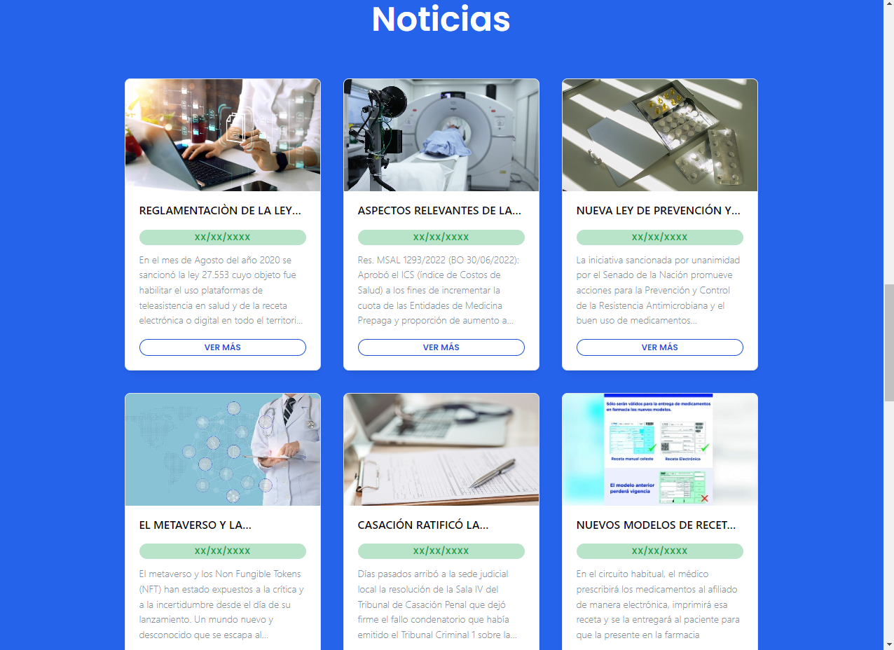
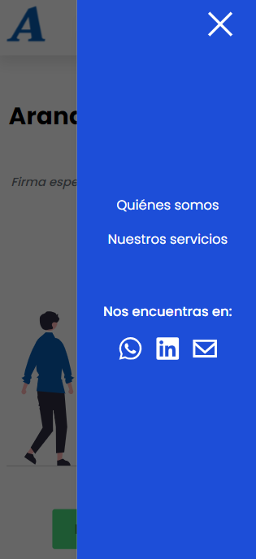
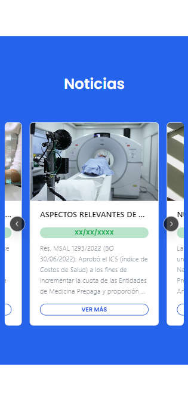

# ARANDA SALUD LEGAL

¡Bienvenido a mi página web! Esta es una página web simple, creada utilizando React-Vite como base y aprovechando las potentes características de Mantine, Tailwind CSS y EmailJS para crear una experiencia única.

## Características

- Interfaz de usuario moderna y atractiva con Mantine y Tailwind CSS.
- Formulario de contacto que envía correos electrónicos utilizando EmailJS.
- Carga rápida y rendimiento optimizado gracias a React-Vite.

## Demo

Puedes ver una demostración en vivo de la página web [aquí](https://aranda-salud-legal.vercel.app/).

## Capturas de Pantalla

### Vista de escritorio

### Vista de móvil

## Contribuciones

¡Las contribuciones son bienvenidas! Si encuentras un problema o quieres agregar una nueva característica, no dudes en abrir un problema o enviar un pull request.
